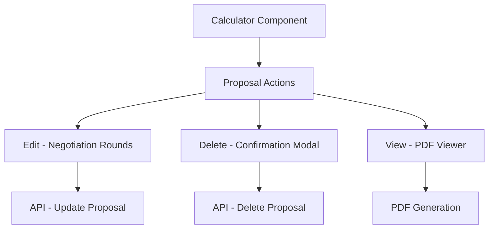

# Design Document

## Overview

Este documento descreve o design para replicar as funcionalidades do MaquinasVirtuaisCalculator para os demais calculadores do sistema. O design foca na padronização de componentes, interfaces e funcionalidades para garantir consistência e manutenibilidade.

## Architecture

### Component Structure
```
src/components/calculators/
├── PABXSIPCalculator.tsx
├── FiberLinkCalculator.tsx  
├── RadioInternetCalculator.tsx
├── DoubleRadioFibraCalculator.tsx
└── shared/
    ├── ProposalActions.tsx
    ├── NegotiationRounds.tsx
    ├── ProposalViewer.tsx
    └── DeleteConfirmation.tsx
```

### Data Flow


## Components and Interfaces

### 1. Shared Components

#### ProposalActions Component
```typescript
interface ProposalActionsProps {
  proposal: Proposal;
  onEdit: (proposal: Proposal) => void;
  onDelete: (proposalId: string) => void;
  onView: (proposal: Proposal) => void;
}
```

#### NegotiationRounds Component
```typescript
interface NegotiationRoundsProps {
  proposal: Proposal;
  onSave: (updatedProposal: Proposal) => void;
  onClose: () => void;
}

interface NegotiationRound {
  id: string;
  originalValue: number;
  discountPercentage: number;
  discountedValue: number;
  createdAt: Date;
  notes?: string;
}
```

#### ProposalViewer Component
```typescript
interface ProposalViewerProps {
  proposal: Proposal;
  isOpen: boolean;
  onClose: () => void;
}
```

### 2. Calculator Updates

Cada calculador será atualizado para incluir:

1. **State Management**
   - `selectedProposal`: Para armazenar proposta selecionada
   - `showNegotiationRounds`: Controle do modal de negociação
   - `showProposalViewer`: Controle do modal de visualização
   - `showDeleteConfirmation`: Controle do modal de confirmação

2. **Action Handlers**
   - `handleEditProposal`: Abre rodadas de negociação
   - `handleDeleteProposal`: Abre confirmação de exclusão
   - `handleViewProposal`: Abre visualizador de proposta
   - `handleConfirmDelete`: Executa exclusão via API

3. **UI Updates**
   - Adicionar coluna "Ações" na tabela de propostas
   - Integrar modais para cada funcionalidade
   - Manter consistência visual com MaquinasVirtuaisCalculator

## Data Models

### Standardized Proposal Interface
```typescript
interface Proposal {
  id: string;
  client: string;
  accountManager: string;
  totalValue: number;
  createdAt: Date;
  updatedAt: Date;
  status: 'draft' | 'sent' | 'approved' | 'rejected';
  negotiationRounds?: NegotiationRound[];
  // Calculator-specific fields
  calculatorType: 'vm' | 'pabx' | 'fiber' | 'radio' | 'double-radio';
  calculatorData: any; // Specific data for each calculator
}
```

### API Request/Response Structure
```typescript
interface ProposalRequest {
  client_data: string;
  account_manager_data: string;
  total_value: number;
  calculator_type: string;
  calculator_data: any;
}

interface ProposalResponse {
  id: string;
  client_data: string;
  account_manager_data: string;
  total_value: number;
  created_at: string;
  updated_at: string;
  status: string;
}
```

## Error Handling

### 1. API Error Standardization
- Padronizar tratamento de erros em todos os calculadores
- Implementar parsing consistente de respostas de erro
- Exibir mensagens de erro user-friendly

### 2. Validation
- Validação client-side antes de enviar dados
- Validação server-side nos endpoints da API
- Feedback imediato para o usuário

### 3. Error Recovery
- Retry automático para falhas de rede
- Fallback para dados em cache quando apropriado
- Logs detalhados para debugging

## Testing Strategy

### 1. Unit Tests
- Testar cada componente compartilhado isoladamente
- Testar handlers de ação em cada calculador
- Testar transformação de dados e validação

### 2. Integration Tests
- Testar fluxo completo de criação/edição/exclusão de propostas
- Testar integração entre calculadores e API
- Testar navegação entre diferentes estados dos modais

### 3. E2E Tests
- Testar jornada completa do usuário em cada calculador
- Testar consistência entre diferentes calculadores
- Testar cenários de erro e recuperação

## Implementation Approach

### Phase 1: Shared Components
1. Extrair componentes compartilhados do MaquinasVirtuaisCalculator
2. Criar interfaces TypeScript padronizadas
3. Implementar componentes reutilizáveis

### Phase 2: Calculator Updates
1. Atualizar PABXSIPCalculator
2. Atualizar FiberLinkCalculator
3. Atualizar RadioInternetCalculator
4. Atualizar DoubleRadioFibraCalculator

### Phase 3: Testing & Refinement
1. Implementar testes para todos os componentes
2. Validar consistência entre calculadores
3. Otimizar performance e UX

## Performance Considerations

- Lazy loading dos modais para reduzir bundle inicial
- Memoização de componentes pesados
- Debounce em operações de busca e filtro
- Cache de propostas para melhorar responsividade