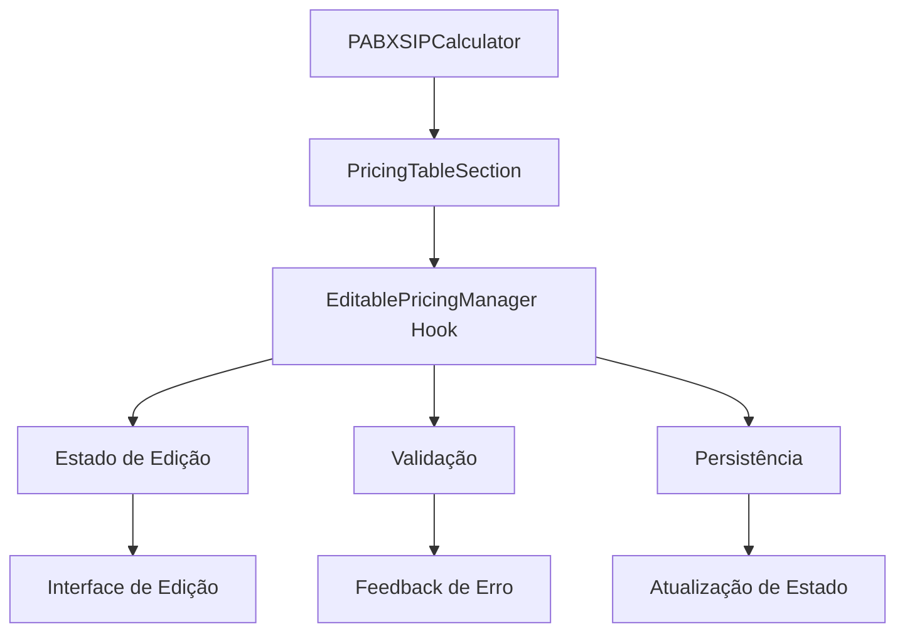

# Design Document

## Overview

Esta funcionalidade implementará um sistema de edição inline para os valores dos planos PABX Premium (Essencial e Profissional). A solução permitirá que usuários editem valores diretamente nas tabelas de preços, com controles de editar/salvar/cancelar, mantendo a consistência visual e a experiência do usuário.

A implementação será baseada na arquitetura existente do componente `PricingTableSection`, estendendo-o com funcionalidades de edição sem quebrar a compatibilidade com o uso atual.

## Architecture

### Componentes Principais

1. **PricingTableSection (Modificado)**: Componente principal que renderiza as tabelas de preços, agora com suporte a edição
2. **EditablePricingManager**: Hook customizado para gerenciar o estado de edição
3. **PricingValidation**: Utilitários de validação para valores editados
4. **PricingPersistence**: Camada de persistência para salvar alterações

### Fluxo de Dados



### Estados da Aplicação

- **Visualização**: Estado padrão, valores são exibidos como texto formatado
- **Edição**: Valores são exibidos como inputs editáveis
- **Salvando**: Estado transitório durante persistência
- **Erro**: Estado quando há falhas de validação ou persistência

## Components and Interfaces

### 1. EditablePricingManager Hook

```typescript
interface EditablePricingState {
  isEditing: boolean;
  editingSection: string | null;
  editedPlans: Map<string, PricingPlan>;
  errors: Map<string, string>;
  isSaving: boolean;
}

interface EditablePricingActions {
  startEditing: (sectionId: string) => void;
  cancelEditing: () => void;
  saveChanges: () => Promise<boolean>;
  updatePlanValue: (planId: string, tableId: string, rowIndex: number, value: number) => void;
  validateValue: (value: number) => string | null;
}

const useEditablePricing = (
  initialSections: PricingSection[]
): [EditablePricingState, EditablePricingActions]
```

### 2. PricingTableSection (Modificado)

```typescript
interface PricingTableSectionProps {
  section: PricingSection;
  formatCurrency: (value: number) => string;
  className?: string;
  // Novas props para edição
  isEditable?: boolean;
  isEditing?: boolean;
  onStartEdit?: () => void;
  onSaveEdit?: () => Promise<boolean>;
  onCancelEdit?: () => void;
  onPlanChange?: (planId: string, updatedPlan: PricingPlan) => void;
  editingErrors?: Map<string, string>;
  isSaving?: boolean;
}
```

### 3. EditableControls Component

```typescript
interface EditableControlsProps {
  isEditing: boolean;
  isSaving: boolean;
  onEdit: () => void;
  onSave: () => Promise<boolean>;
  onCancel: () => void;
  hasErrors: boolean;
}
```

### 4. PricingValidation Utilities

```typescript
interface ValidationResult {
  isValid: boolean;
  error?: string;
}

interface PricingValidationRules {
  validateValue: (value: number) => ValidationResult;
  validateDecomposition: (value: number, decomposition?: string) => ValidationResult;
  validatePlan: (plan: PricingPlan) => Map<string, string>;
}
```

## Data Models

### Estado de Edição Estendido

```typescript
interface EditablePricingRow extends PricingRow {
  isEditing?: boolean;
  hasError?: boolean;
  errorMessage?: string;
}

interface EditablePricingTable extends Omit<PricingTable, 'rows'> {
  rows: EditablePricingRow[];
}

interface EditablePricingPlan extends Omit<PricingPlan, 'tables'> {
  tables: EditablePricingTable[];
  isModified?: boolean;
}
```

### Configuração de Validação

```typescript
interface ValidationConfig {
  minValue: number; // Valor mínimo permitido
  maxValue: number; // Valor máximo permitido
  decimalPlaces: number; // Casas decimais permitidas
  required: boolean; // Se o campo é obrigatório
}

const PRICING_VALIDATION_CONFIG: ValidationConfig = {
  minValue: 0.01,
  maxValue: 9999.99,
  decimalPlaces: 2,
  required: true
};
```

## Error Handling

### Tipos de Erro

1. **Validation Errors**: Valores inválidos (negativos, muito grandes, formato incorreto)
2. **Network Errors**: Falhas na comunicação durante salvamento
3. **Concurrency Errors**: Conflitos quando múltiplos usuários editam simultaneamente
4. **Permission Errors**: Usuário sem permissão para editar

### Estratégias de Tratamento

```typescript
interface ErrorHandlingStrategy {
  // Validação em tempo real
  onValueChange: (value: string) => ValidationResult;
  
  // Tratamento de erros de salvamento
  onSaveError: (error: Error) => void;
  
  // Recuperação de erros
  retryOperation: () => Promise<boolean>;
  
  // Feedback ao usuário
  displayError: (error: string, type: 'validation' | 'network' | 'permission') => void;
}
```

### Mensagens de Erro

```typescript
const ERROR_MESSAGES = {
  INVALID_VALUE: 'Valor deve ser um número positivo',
  VALUE_TOO_LOW: 'Valor deve ser maior que R$ 0,01',
  VALUE_TOO_HIGH: 'Valor deve ser menor que R$ 9.999,99',
  NETWORK_ERROR: 'Erro ao salvar. Tente novamente.',
  PERMISSION_ERROR: 'Você não tem permissão para editar preços',
  REQUIRED_FIELD: 'Este campo é obrigatório'
} as const;
```

## Testing Strategy

### Testes Unitários

1. **EditablePricingManager Hook**
   - Estados de transição (visualização → edição → salvamento)
   - Validação de valores
   - Persistência de alterações
   - Cancelamento de edições

2. **PricingTableSection Component**
   - Renderização em modo visualização
   - Renderização em modo edição
   - Interações do usuário (cliques, digitação)
   - Exibição de erros

3. **Validation Utilities**
   - Validação de valores numéricos
   - Validação de decomposição
   - Validação de planos completos

### Testes de Integração

1. **Fluxo Completo de Edição**
   - Iniciar edição → modificar valores → salvar → verificar persistência
   - Iniciar edição → modificar valores → cancelar → verificar rollback

2. **Validação End-to-End**
   - Edição com valores válidos
   - Edição com valores inválidos
   - Comportamento com erros de rede

### Testes de Usabilidade

1. **Navegação por Teclado**
   - Tab entre campos
   - Enter para salvar
   - Escape para cancelar

2. **Responsividade**
   - Comportamento em diferentes tamanhos de tela
   - Usabilidade em dispositivos móveis

### Casos de Teste Específicos

```typescript
describe('PABX Premium Editable Pricing', () => {
  describe('Editing Flow', () => {
    it('should enable editing mode when edit button is clicked');
    it('should show input fields for all values in editing mode');
    it('should validate values in real-time');
    it('should save changes when save button is clicked');
    it('should cancel changes when cancel button is clicked');
  });

  describe('Validation', () => {
    it('should reject negative values');
    it('should reject values above maximum');
    it('should accept valid decimal values');
    it('should show appropriate error messages');
  });

  describe('Persistence', () => {
    it('should update pricing data after successful save');
    it('should maintain changes across component re-renders');
    it('should handle save failures gracefully');
  });
});
```

## Implementation Considerations

### Performance

- **Debounced Validation**: Validação com delay para evitar execução excessiva durante digitação
- **Memoization**: Uso de `useMemo` e `useCallback` para otimizar re-renders
- **Lazy Loading**: Carregamento sob demanda de utilitários de validação

### Accessibility

- **ARIA Labels**: Labels apropriados para campos de edição
- **Keyboard Navigation**: Suporte completo à navegação por teclado
- **Screen Reader Support**: Anúncios de mudanças de estado
- **Focus Management**: Controle adequado do foco durante transições

### Compatibilidade

- **Backward Compatibility**: Manter compatibilidade com uso atual do PricingTableSection
- **Progressive Enhancement**: Funcionalidade de edição como enhancement opcional
- **Graceful Degradation**: Fallback para modo somente leitura em caso de erros

### Segurança

- **Input Sanitization**: Sanitização de valores de entrada
- **XSS Prevention**: Prevenção de ataques de script
- **Validation**: Validação tanto no frontend quanto no backend (quando implementado)